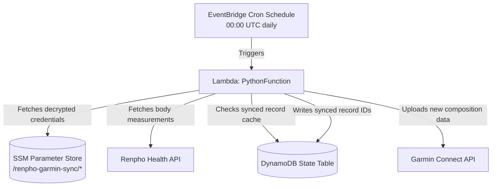

# AWS Renpho-Garmin Sync

An automated, serverless daily sync tool that pulls personal weight and body composition measurements from your Renpho smart scale and synchronizes them directly with your Garmin Connect account.

Built using the **AWS Cloud Development Kit (CDK)** in TypeScript, this project deploys an AWS Lambda Python function scheduled to run once per day, backed by a DynamoDB state table to prevent duplicate uploads.

---

## Architecture Overview



### Key Components
1. **AWS Lambda (Python 3.11):** Executes the sync logic using the unofficial `renpho-api` and `python-garminconnect` Python clients.
2. **Amazon DynamoDB:** Stores previously synchronized record IDs from Renpho to prevent duplicate uploads to Garmin Connect.
3. **Amazon EventBridge:** Triggers the Lambda function daily (configured at `00:00 UTC`).
4. **AWS Systems Manager (SSM) Parameter Store:** Encrypts and securely stores your Renpho and Garmin credentials using `SecureString` parameters.

---

## Features
* **Zero Plaintext Secrets:** No credentials are hardcoded, stored in version control, or put in compiled CloudFormation templates.
* **Smart Syncing:** Queries all historical records, filters out already synchronized records using a DynamoDB cache check, and imports new weight values.
* **Rate Limit Protection:** Features defensive execution limits (batch limits) and gentle pacing delays between Garmin API calls to protect your Garmin account from being flagged or throttled.
* **Comprehensive Metrics:** Synchronizes:
  * Weight (kg)
  * Body Fat (%)
  * Body Water / Hydration (%)
  * Body Mass Index (BMI)
  * Bone Mass (kg)

---

## Project Structure

* **`bin/aws-renpho-garmin-sync.ts`** - Entrypoint for the CDK application.
* **`lib/aws-renpho-garmin-sync-stack.ts`** - Defines the AWS infrastructure (Lambda, DynamoDB, EventBridge rule, SSM parameter permissions).
* **`lambda/`** - Code directory for the Python Lambda function:
  * **`index.py`** - Core synchronization execution handler.
  * **`requirements.txt`** - Libraries packages (`renpho-api`, `python-garminconnect`).
* **`create-ssm-params.sh`** - Bootstrapping helper script to write credentials securely to AWS SSM Parameter Store via the AWS CLI.

---

## Prerequisites
Before you start, make sure you have:
1. **AWS CLI** installed and configured with appropriate permissions.
2. **Node.js** (v18+) and npm.
3. **Docker** installed and running (required by CDK for building and packaging Python dependencies inside the Lambda function).

---

## Setup & Deployment

### 1. Configure SSM Credentials
Before deploying the stack, run the bootstrap script to securely upload your credentials to AWS SSM Parameter Store:

```bash
./create-ssm-params.sh
```

This script prompts you for the email and password for both your Renpho and Garmin Connect accounts, masking passwords as you type them. It stores them under:
* `/renpho-garmin-sync/renpho_email`
* `/renpho-garmin-sync/renpho_password`
* `/renpho-garmin-sync/garmin_email`
* `/renpho-garmin-sync/garmin_password`

### 2. Deploy Infrastructure
Install dependencies, compile the TypeScript code, and deploy the stack using the AWS CDK:

```bash
# Install npm dependencies
npm install

# Synthesize and verify the cloud formation templates
npx cdk synth

# Deploy the stack to your AWS Account
npx cdk deploy
```

---

## Customization & Batching

The application manages rate limits and Lambda timeouts using the `BATCH_LIMIT` environment variable. 

In case the Renpho Health account has a large number of historical records, we define a safe ceiling per execution to respect AWS Lambda runtime limits and Garmin API limits. If the batch limit is reached, the remaining records will be processed in the next run. After historical syncing is complete, only new daily measurements will be synced, so the batch limit will no longer be relevant. If you are in a hurry, you can run the Lambda function multiple times to sync your Renpho history, or you can just let it get processed over multiple days during the scheduled daily syncs.

* **Default Value:** `1` (for safe initial testing / smoke test).
* **Recommended Value:** `100` (for production, regular operation).

This can be updated in the CDK stack ([lib/aws-renpho-garmin-sync-stack.ts](lib/aws-renpho-garmin-sync-stack.ts)) or directly in the AWS Lambda Console under Configuration ──► Environment Variables.

---

## Useful CDK Commands

* `npm run build`   Compile TypeScript to JS
* `npx cdk diff`    Compare deployed stack with current local state
* `npx cdk deploy`  Deploy the stack to your default AWS account/region
* `npx cdk destroy` Tear down all resources created by this stack

---

## Disclaimer
This project is for personal use and is not officially affiliated with Renpho or Garmin. It relies on reverse-engineered, unofficial APIs that are subject to change without notice. Please use responsibly to prevent API rate-limiting or account restrictions.
